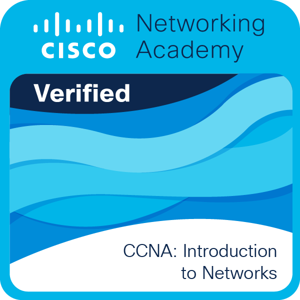
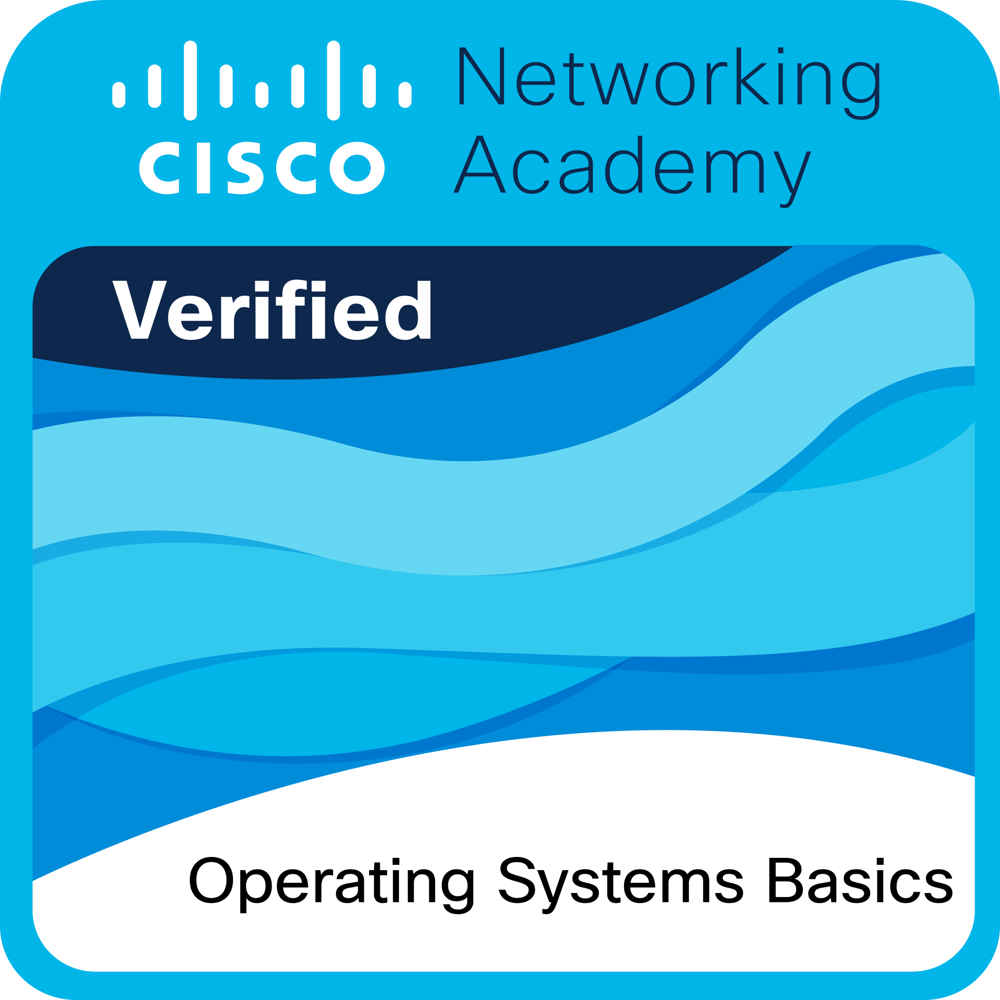

<!-- ═══════════════════════════════════════════════════════════════════════════════ -->
<!-- ░█████╗░██████╗░██╗░░░██╗░█████╗░  ░██╗░░░░░░░██╗██╗░██████╗░██╗░░░██╗███╗░░██╗░█████╗░ -->
<!-- ██╔══██╗██╔══██╗╚██╗░██╔╝██╔══██╗  ░██║░░██╗░░██║██║██╔════╝░██║░░░██║████╗░██║██╔══██╗ -->
<!-- ███████║██████╔╝░╚████╔╝░███████║  ░╚██╗████╗██╔╝██║██║░░██╗░██║░░░██║██╔██╗██║███████║ -->
<!-- ██╔══██║██╔══██╗░░╚██╔╝░░██╔══██║  ░░████╔═████║░██║██║░░╚██╗██║░░░██║██║╚████║██╔══██║ -->
<!-- ██║░░██║██║░░██║░░░██║░░░██║░░██║  ░░╚██╔╝░╚██╔╝░██║╚██████╔╝╚██████╔╝██║░╚███║██║░░██║ -->
<!-- ╚═╝░░╚═╝╚═╝░░╚═╝░░░╚═╝░░░╚═╝░░╚═╝  ░░░╚═╝░░░╚═╝░░╚═╝░╚═════╝░░╚═════╝░╚═╝░░╚══╝╚═╝░░╚═╝ -->
<!-- ═══════════════════════════════════════════════════════════════════════════════ -->

<div align="center">
  
</div>

<div align="center">
  <a href="https://git.io/typing-svg">
    
  </a>
</div>

<br/>

<!-- ═══════════════════════════════════════════════════════════════════════════════ -->
<!--                              PROFILE BADGES                                     -->
<!-- ═══════════════════════════════════════════════════════════════════════════════ -->

<div align="center">
  
  [](https://github.com/AryaWgna)
  [](https://github.com/AryaWgna?tab=followers)
  [](https://github.com/AryaWgna?tab=repositories)
  [](https://github.com/AryaWgna)
  
</div>

<br/>

<!-- ═══════════════════════════════════════════════════════════════════════════════ -->
<!--                              TROPHIES                                           -->
<!-- ═══════════════════════════════════════════════════════════════════════════════ -->

<div align="center">
  
</div>

<br/>


<!-- ═══════════════════════════════════════════════════════════════════════════════ -->
<!--                              ABOUT ME                                           -->
<!-- ═══════════════════════════════════════════════════════════════════════════════ -->

<h2>
  
  <b> About Me</b>
</h2>


<br/>

```typescript
const aryaWiguna: Developer = {
  pronouns: "He" | "Him",
  location: "Indonesia 🇮🇩",
  currentRole: "Full Stack Developer",
  
  code: {
    languages: ["TypeScript", "JavaScript", "Python", "Go", "PHP", "Dart", "C#"],
    frontend: ["React", "Vue.js", "Next.js", "Angular", "Nuxt.js", "Svelte"],
    backend: ["Node.js", "Laravel", "Flask", "Gin", ".NET", "Express", "NestJS"],
    mobile: ["Flutter", "React Native"],
    database: ["PostgreSQL", "MySQL", "MongoDB", "Redis", "Firebase"],
    devOps: ["Docker", "Git", "Nginx", "Linux", "CI/CD", "AWS"],
  },
  
  architecture: ["Microservices", "Event-Driven", "Design Patterns", "REST API", "GraphQL"],
  
  currentlyLearning: ["Cloud Architecture", "Kubernetes", "System Design"],
  
  askMeAbout: ["Web Dev", "Mobile Dev", "Tech", "Open Source"],
  
  funFact: "I think I'm an introvert... tapi boong 🤫",
  
  lifePhilosophy: "First, solve the problem. Then, write the code."
};
```

<br clear="both"/>

<!-- ═══════════════════════════════════════════════════════════════════════════════ -->
<!--                              CURRENT FOCUS                                      -->
<!-- ═══════════════════════════════════════════════════════════════════════════════ -->

<h3>
  
  <b> What I'm Up To</b>
</h3>

<table align="center">
<tr>
<td width="50%">

```yaml
🔭 Currently Building:
  - Scalable Full-Stack Applications
  - Cloud-Native Solutions
  - Open Source Projects
  
📚 Learning:
  - Laravel & PostgreSQL (Mastering)
  - Cloud Architecture
  - System Design Patterns
  
🎯 2026 Goals:
  - Contribute to 20+ Open Source Projects
  - Build a SaaS Product
  - Master Kubernetes
```

</td>
<td width="50%">

```yaml
✍️ Creating Content:
  - Technical Blog Posts
  - Code Tutorials
  - Development Tips

🤝 Open To:
  - Collaboration
  - Freelance Projects  
  - Tech Discussions
  
☕ Fun Facts:
  - Coffee-Powered Coding
  - Night Owl Developer
  - Keyboard Enthusiast
```

</td>
</tr>
</table>

<br/>


<!-- ═══════════════════════════════════════════════════════════════════════════════ -->
<!--                              TECH STACK                                         -->
<!-- ═══════════════════════════════════════════════════════════════════════════════ -->

<h2>
  
  <b> Tech Stack & Tools</b>
</h2>

<br/>

<table align="center">
<tr>
<td valign="top" width="33%">

<h3 align="center">🎨 Frontend</h3>
<div align="center">
<a href="#"></a>
<br/><br/>
<a href="#"></a>
<br/><br/>
<a href="#"></a>
</div>

</td>
<td valign="top" width="33%">

<h3 align="center">⚙️ Backend</h3>
<div align="center">
<a href="#"></a>
<br/><br/>
<a href="#"></a>
<br/><br/>
<a href="#"></a>
</div>

</td>
<td valign="top" width="33%">

<h3 align="center">📱 Mobile & Database</h3>
<div align="center">
<a href="#"></a>
<br/><br/>
<a href="#"></a>
</div>

</td>
</tr>
</table>

<table align="center">
<tr>
<td valign="top" width="50%">

<h3 align="center">🛠️ DevOps & Tools</h3>
<div align="center">
<a href="#"></a>
<br/><br/>
<a href="#"></a>
</div>

</td>
<td valign="top" width="50%">

<h3 align="center">🔧 IDE & Design</h3>
<div align="center">
<a href="#"></a>
<br/><br/>
<a href="#"></a>
</div>

</td>
</tr>
</table>

<br/>


<!-- ═══════════════════════════════════════════════════════════════════════════════ -->
<!--                              GITHUB STATS                                       -->
<!-- ═══════════════════════════════════════════════════════════════════════════════ -->

<h2>
  
  <b> GitHub Statistics</b>
</h2>

<br/>

<div align="center">
   
  
</div>

<br/>

<div align="center">
  
</div>

<br/>

<div align="center">
  
</div>

<br/>

<!-- ═══════════════════════════════════════════════════════════════════════════════ -->
<!--                              METRICS                                            -->
<!-- ═══════════════════════════════════════════════════════════════════════════════ -->

<details>
<summary><h3>📊 More Detailed Stats</h3></summary>

<br/>

<div align="center">
  
</div>

<br/>

<div align="center">
  
  
</div>

<br/>

<div align="center">
  
  
</div>

</details>

<br/>


<!-- ═══════════════════════════════════════════════════════════════════════════════ -->
<!--                              FEATURED PROJECTS                                  -->
<!-- ═══════════════════════════════════════════════════════════════════════════════ -->

<h2>
  
  <b> Featured Projects</b>
</h2>

<br/>

<div align="center">
<a href="https://github.com/AryaWgna/Arya-intelligence">
  
</a>
<a href="https://github.com/AryaWgna/Dashboard-Framework">
  
</a>
</div>

<div align="center">
<a href="https://github.com/AryaWgna/go-restapi-gin">
  
</a>
<a href="https://github.com/AryaWgna/Speech-To-Text">
  
</a>
</div>

<div align="center">
<a href="https://github.com/AryaWgna/Calculator-Split">
  
</a>
<a href="https://github.com/AryaWgna/FlutterSchools">
  
</a>
</div>

<br/>

<div align="center">
  <a href="https://github.com/AryaWgna?tab=repositories">
    
  </a>
</div>

<br/>


<!-- ═══════════════════════════════════════════════════════════════════════════════ -->
<!--                              CERTIFICATIONS                                     -->
<!-- ═══════════════════════════════════════════════════════════════════════════════ -->

<h2>
  
  <b> Certifications & Achievements</b>
</h2>

<br/>

<div align="center">

<table>
<tr>
<td align="center" width="33%">

<br/>
<h4>🌐 CCNA: Introduction to Networks</h4>
<p><i>Networking Architecture & Protocols</i></p>
<a href="./Sertifkat/CCNAITNUpdated20251128-31-uohl23.pdf">

</a>
</td>
<td align="center" width="33%">

<br/>
<h4>🗣️ English for IT 1</h4>
<p><i>IT Terminology & Communication</i></p>
<a href="./Sertifkat/EnglishforIT1Update20251128-32-gfbjsw.pdf">

</a>
</td>
<td align="center" width="33%">

<br/>
<h4>💻 Operating Systems Basics</h4>
<p><i>OS Fundamentals & Architecture</i></p>
<a href="./Sertifkat/OperatingSystemsBasicsUpdate20251128-30-jb59v3.pdf">

</a>
</td>
</tr>
</table>

</div>

<br/>


<!-- ═══════════════════════════════════════════════════════════════════════════════ -->
<!--                              CONTRIBUTION SNAKE                                 -->
<!-- ═══════════════════════════════════════════════════════════════════════════════ -->

<h2>
  
  <b> Contribution Snake</b>
</h2>

<br/>

<div align="center">
  <picture>
    <source media="(prefers-color-scheme: dark)" srcset="https://raw.githubusercontent.com/AryaWgna/AryaWgna/output/github-contribution-grid-snake-dark.svg">
    <source media="(prefers-color-scheme: light)" srcset="https://raw.githubusercontent.com/AryaWgna/AryaWgna/output/github-contribution-grid-snake.svg">
    
  </picture>
</div>

<br/>


<!-- ═══════════════════════════════════════════════════════════════════════════════ -->
<!--                              CONNECT WITH ME                                    -->
<!-- ═══════════════════════════════════════════════════════════════════════════════ -->

<h2>
  
  <b> Let's Connect!</b>
</h2>

<br/>

<div align="center">
  
  <a href="https://linkedin.com/in/arya-wgna" target="_blank">
    
  </a>
  <a href="mailto:wgnarya123@gmail.com">
    
  </a>
  <a href="https://aryawgna.blogspot.com" target="_blank">
    
  </a>
  <a href="https://instagram.com/arya.wgna" target="_blank">
    
  </a>
  <a href="https://discord.gg/yourdiscord" target="_blank">
    
  </a>
  
</div>

<br/>

<div align="center">
  
  ```
  ╔═══════════════════════════════════════════════════════════════════════════════╗
  ║                                                                               ║
  ║   📫  How to reach me:           wgnarya123@gmail.com                         ║
  ║   💼  LinkedIn:                  linkedin.com/in/arya-wgna                    ║
  ║   📝  Blog:                      aryawgna.blogspot.com                        ║
  ║   📸  Instagram:                 @arya.wgna                                   ║
  ║                                                                               ║
  ╚═══════════════════════════════════════════════════════════════════════════════╝
  ```
</div>

<br/>


<!-- ═══════════════════════════════════════════════════════════════════════════════ -->
<!--                              SUPPORT ME                                         -->
<!-- ═══════════════════════════════════════════════════════════════════════════════ -->

<h2>
  
  <b> Support My Work</b>
</h2>

<br/>

<div align="center">
  <p><i>If you find my work helpful, consider buying me a coffee! ☕</i></p>
  
  <a href="https://saweria.co/aryawgna" target="_blank">
    
  </a>
  <a href="https://trakteer.id/aryawgna" target="_blank">
    
  </a>
  <a href="https://www.buymeacoffee.com/aryawgna" target="_blank">
    
  </a>
  <a href="https://ko-fi.com/aryawgna" target="_blank">
    
  </a>
</div>

<br/>


<!-- ═══════════════════════════════════════════════════════════════════════════════ -->
<!--                              QUOTE                                              -->
<!-- ═══════════════════════════════════════════════════════════════════════════════ -->

<h2>
  
  <b> Random Dev Quote</b>
</h2>

<br/>

<div align="center">
  
</div>

<br/>

<!-- ═══════════════════════════════════════════════════════════════════════════════ -->
<!--                              FOOTER                                             -->
<!-- ═══════════════════════════════════════════════════════════════════════════════ -->

<div align="center">
  
</div>

<div align="center">
  
  <br/>
  
  
  
  
  
  <br/><br/>
  
  ```
  ⚡ "Code is like humor. When you have to explain it, it's bad." – Cory House
  ```
  
  <br/>
  
  
  
</div>

<!-- ═══════════════════════════════════════════════════════════════════════════════ -->
<!--                              END OF README                                      -->
<!-- ═══════════════════════════════════════════════════════════════════════════════ -->
